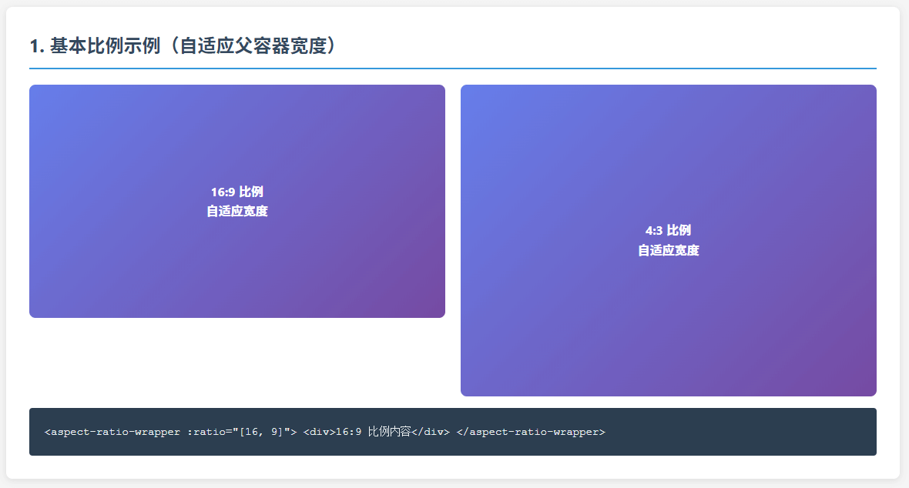
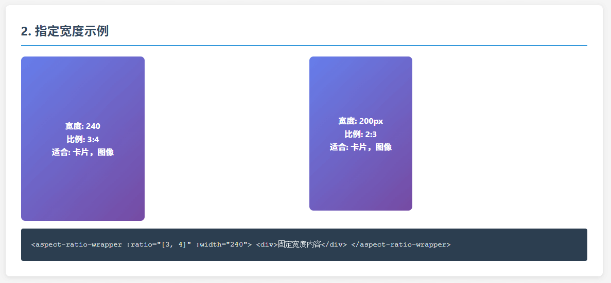
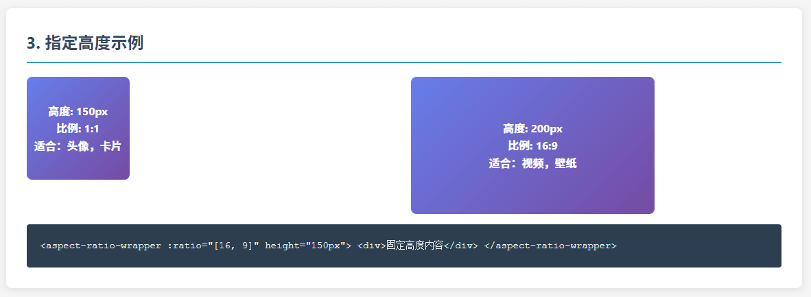

# Vue Aspect Ratio Box

[中文文档](./README_zh.md) | English

A Vue.js component for maintaining aspect ratios, supporting Vue 3 with flexible width/height control.

## Features

- 🎯 **Precise Ratio Control**: Support for any aspect ratio settings
- 🔧 **Flexible Size Control**: Specify width or height, automatically calculate the other dimension
- 📱 **Responsive Design**: Adapts to parent container width by default
- 🚀 **Vue 3 Compatible**: Supports Vue 3.0+
- 📝 **TypeScript Support**: Complete type definitions
- 🎨 **Zero Style Intrusion**: Does not affect content styles
- 😄 **Compatibility**: Downgraded compatibility


## Legend





## Installation

```bash
npm install vue-aspect-ratio-box
# or
yarn add vue-aspect-ratio-box
# or
pnpm add vue-aspect-ratio-box
```

## Usage

### Global Registration

```javascript
import { createApp } from 'vue'
import VueAspectRatioBox from 'vue-aspect-ratio-box'
import App from './App.vue'

const app = createApp(App)
app.use(VueAspectRatioBox)
app.mount('#app')
```

### Local Registration

```javascript
import { AspectRatioBox } from 'vue-aspect-ratio-box'

export default {
  components: {
    AspectRatioBox
  }
}
```

### Basic Usage

```vue
<template>
  <!-- 16:9 aspect ratio, adapts to parent width -->
  <AspectRatioBox :ratio="[16, 9]">
    
  </AspectRatioBox>

  <!-- Specify width, height calculated automatically -->
  <AspectRatioBox :ratio="[4, 3]" :width="400">
    <div>Your content here</div>
  </AspectRatioBox>

  <!-- Specify height, width calculated automatically -->
  <AspectRatioBox :ratio="[16, 9]" :height="200">
    <video src="your-video.mp4" controls></video>
  </AspectRatioBox>
</template>
```

## API

### Props

| Prop | Type | Required | Default | Description |
|------|------|----------|---------|-------------|
| `ratio` | `[number, number]` | ✅ | - | Aspect ratio as `[width, height]` |
| `width` | `number \| string` | ❌ | `undefined` | Fixed width (px or CSS units) |
| `height` | `number \| string` | ❌ | `undefined` | Fixed height (px or CSS units) |

### Behavior

- **Default**: Adapts to parent container width, height calculated by ratio
- **With `width`**: Uses specified width, height calculated by ratio
- **With `height`**: Uses specified height, width calculated by ratio
- **With both**: `width` takes precedence, `height` is ignored

## Examples

### Image Gallery

```vue
<template>
  <div class="gallery">
    <AspectRatioBox 
      v-for="image in images" 
      :key="image.id"
      :ratio="[1, 1]" 
      class="gallery-item"
    >
      
    </AspectRatioBox>
  </div>
</template>

<style>
.gallery {
  display: grid;
  grid-template-columns: repeat(auto-fill, minmax(200px, 1fr));
  gap: 16px;
}

.gallery-item img {
  width: 100%;
  height: 100%;
  object-fit: cover;
}
</style>
```

### Video Player

```vue
<template>
  <AspectRatioBox :ratio="[16, 9]" class="video-container">
    <video 
      src="your-video.mp4" 
      controls 
      class="video-player"
    ></video>
  </AspectRatioBox>
</template>

<style>
.video-container {
  max-width: 800px;
  margin: 0 auto;
}

.video-player {
  width: 100%;
  height: 100%;
}
</style>
```

### Card Layout

```vue
<template>
  <div class="card-grid">
    <AspectRatioBox 
      v-for="card in cards" 
      :key="card.id"
      :ratio="[3, 4]" 
      class="card"
    >
      <div class="card-content">
        <h3>{{ card.title }}</h3>
        <p>{{ card.description }}</p>
      </div>
    </AspectRatioBox>
  </div>
</template>
```

## TypeScript Support

The component includes complete TypeScript definitions:

```typescript
import { AspectRatioBox } from 'vue-aspect-ratio-box'
import type { AspectRatioProps } from 'vue-aspect-ratio-box'

// Props type
interface AspectRatioProps {
  ratio: [number, number]
  width?: number | string
  height?: number | string
}
```

## Browser Compatibility

- **Vue 3**: Requires Vue 3.0.0+
- **Modern Browsers**: Uses native `aspect-ratio` CSS property when available
- **Legacy Browsers**: Falls back to padding-based implementation

## Development

```bash
# Install dependencies
npm install

# Start development server
npm run dev

# Build for production
npm run build

# Generate type definitions
npm run build:types
```

## License

MIT License - see [LICENSE](LICENSE) file for details.

## Contributing

Contributions are welcome! Please feel free to submit a Pull Request.

## Changelog

See [CHANGELOG.md](./CHANGELOG.md) for detailed release notes and version history.
