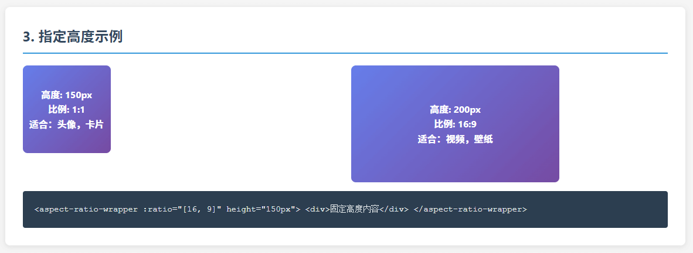

# Vue Aspect Ratio Wrapper

中文文档 | [English](./README.md)

一个用于维持宽高比的 Vue.js 组件，支持 Vue 2 和 Vue 3，提供灵活的宽度/高度控制。

## 特性

- 🎯 **精确比例控制**: 支持任意宽高比例设置
- 🔧 **灵活尺寸控制**: 可指定宽度或高度，自动计算另一维度
- 📱 **响应式设计**: 默认适应父容器宽度
- 🚀 **Vue 2/3 兼容**: 同时支持 Vue 2.6+ 和 Vue 3
- 📝 **TypeScript 支持**: 完整的类型定义
- 🎨 **零样式侵入**: 不影响内容样式

## 图例




## 安装

```bash
npm install vue-aspect-ratio-wrapper
# 或
yarn add vue-aspect-ratio-wrapper
# 或
pnpm add vue-aspect-ratio-wrapper
```

## 使用方法

### 全局注册

**Vue 3:**

```javascript
import { createApp } from 'vue'
import VueAspectRatioWrapper from 'vue-aspect-ratio-wrapper'
import App from './App.vue'

const app = createApp(App)
app.use(VueAspectRatioWrapper)
app.mount('#app')
```

**Vue 2:**

```javascript
import Vue from 'vue'
import VueAspectRatioWrapper from 'vue-aspect-ratio-wrapper'

Vue.use(VueAspectRatioWrapper)
```

### 局部注册

```javascript
import { AspectRatioWrapper } from 'vue-aspect-ratio-wrapper'

export default {
	components: {
		AspectRatioWrapper,
	},
}
```

### 基本用法

```vue
<template>
	<!-- 16:9 比例，自适应父容器宽度 -->
	<AspectRatioWrapper :ratio="[16, 9]">
		
	</AspectRatioWrapper>

	<!-- 3:4 比例，指定宽度为 300，默认单位px -->
	<AspectRatioWrapper :ratio="[3, 4]" :width="300">
		<div class="content">
			<h3>标题</h3>
			<p>内容区域</p>
		</div>
	</AspectRatioWrapper>

	<!-- 1:1 比例，指定高度为 200px -->
	<AspectRatioWrapper :ratio="[1, 1]" height="200px">
		<div class="square-content">正方形内容</div>
	</AspectRatioWrapper>
</template>
```

## API

### Props

| 属性     | 类型               | 必填 | 默认值      | 说明                                                                   |
| -------- | ------------------ | ---- | ----------- | ---------------------------------------------------------------------- |
| `ratio`  | `[number, number]` | ✅   | -           | 宽高比例，格式为 `[宽度, 高度]`                                        |
| `width`  | `number \| string` | ❌   | `undefined` | 指定宽度，可以是数字(默认单位 px)或字符串 10%,200px,200rem,20vw 等单位 |
| `height` | `number \| string` | ❌   | `undefined` | 指定高度，可以是数字(默认单位 px)或字符串 10%,200px,200rem,20vh 等单位 |

### 行为说明

1. **仅指定 `ratio`**: 组件会适应父容器的宽度，并根据比例计算高度
2. **指定 `width`**: 组件使用指定的宽度，根据比例计算高度
3. **指定 `height`**: 组件根据比例计算宽度，使用指定的高度
4. **同时指定 `width` 和 `height`**: `width` 优先级更高，不会取`height`

### 插槽

| 插槽名    | 说明                                 |
| --------- | ------------------------------------ |
| `default` | 默认插槽，用于放置需要保持比例的内容 |

## 示例

### 视频播放器

```vue
<template>
	<AspectRatioWrapper :ratio="[16, 9]">
		<video controls class="video-container">
			<source src="video.mp4" type="video/mp4" />
		</video>
	</AspectRatioWrapper>
</template>

<style>
.video-container {
	width: 100%;
	height: 100%;
}
</style>
```

### 卡片布局

```vue
<template>
	<div class="card-grid">
		<AspectRatioWrapper :ratio="[1, 1]" :width="200">
			<div class="card">
				<p>卡片标题</p>
				<p>卡片内容</p>
			</div>
		</AspectRatioWrapper>
	</div>
</template>

<style>
.card {
	display: flex;
	flex-direction: column;
	justify-content: space-between;
	width: 100%;
	height: 100%;
	border: 1px solid #ddd;
	border-radius: 8px;
	padding: 16px;
}
</style>
```

## TypeScript 支持

组件提供完整的 TypeScript 类型定义：

```typescript
import { AspectRatioWrapper, AspectRatioProps } from 'vue-aspect-ratio-wrapper'

// Props 类型
interface AspectRatioProps {
	ratio: [number, number]
	width?: number | string
	height?: number | string
}
```

## 兼容性

- Vue 2: 需要 Vue 2.6.0+
- Vue 3: 需要 Vue 3.0.0+
- 现代浏览器 (IE11+)

## 许可证

MIT License

## 贡献

欢迎提交 Issue 和 Pull Request！

## 更新日志

### 1.0.0

- 🎉 初始版本发布
- ✨ 支持 Vue 2 和 Vue 3
- ✨ TypeScript 支持
- ✨ 灵活的比例控制
- ✨ 响应式设计
